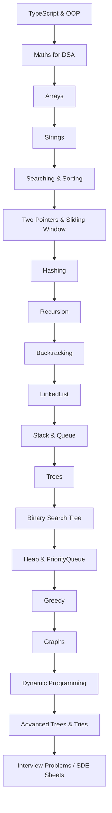

# 🚀 TypeScript DSA Mastery — FAANG Preparation

<div align="center">
  
  
  
  
</div>

---

# 🔥 Why this repository?

### ✔️ Structured TypeScript DSA learning path

### ✔️ Problem-solving roadmap (Striver, CoderArmy, CodeHelp)

### ✔️ Topic-wise notes + patterns

### ✔️ Clean folder READMEs (templates included)

### ✔️ Eye-catchy design for GitHub visitors

---

# 📂 Folder Structure (Your Repo: `dsa-typescript/`)

```
📦 dsa-typescript
├── 00-utils/             # helpers like print, assert, timer, clone
├── 01-arrays/
│   ├── 1d/
│   │   ├── 00-1d-basics/
│   │   ├── 01-1d-problems/
│   │   ├── 02-1d-medium/
│   │   └── 03-1d-advanced/
│   ├── 2d/
│   └── problems/
├── 02-binary-search/
├── 03-sorting/
│   ├── basic/
│   └── advanced/
├── 04-recursion/
├── 05-strings/
├── 06-oop/
├── 07-linked-list/
├── 08-stack/
├── 09-queue/
├── 10-hashing/
├── 11-binary-tree/
├── 12-bst/
├── 13-graph/
├── 14-heap/
├── 15-greedy/
├── 16-backtracking/
└── 17-dp/
```

---

### 🔵 Core Topics


### 🟣 Data Structures


### 🟠 Algorithms


### 🟤 TypeScript Essentials


---

# 🧭 DSA Roadmap (Mermaid Diagram)



---

# 📐 Coding Standards (TypeScript)

* **Class names → PascalCase**
* **Methods & variables → camelCase**
* Only **1 problem per file**
* Add **Time & Space Complexity** at the top of each file
* Clean, readable, and modular code
* Use **meaningful variable names**: `left`, `right`, `freq`, `visited`
* Always **use TypeScript types** (`number[]`, `string[]`, `Map<number, number>` etc.)
* Use **helpers from `00-utils`** for print/assert/test

---

# 📜 License

Licensed under **Apache 2.0**
---
